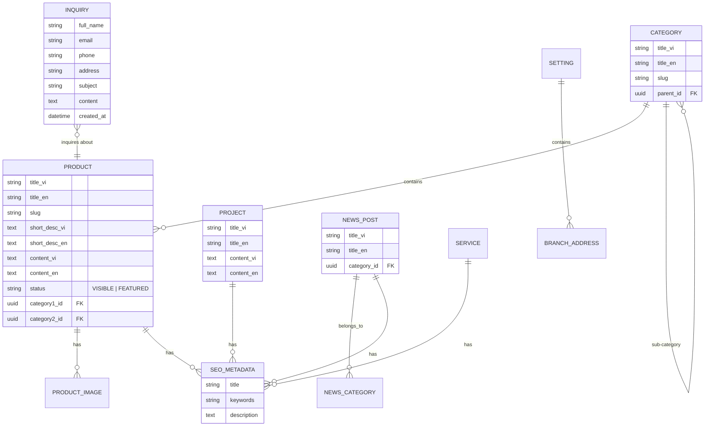
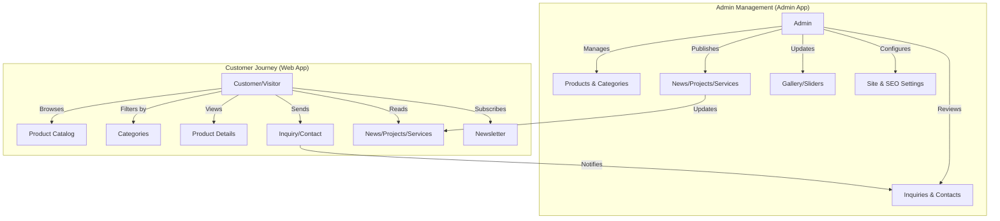
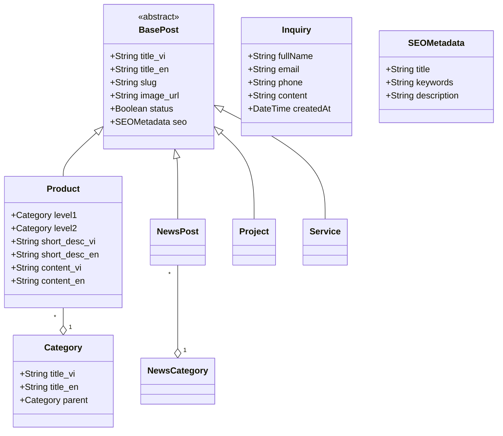

# Thien An Furniture Monorepo

Replacement repository for [thienanfurniture.com](https://thienanfurniture.com/). This project uses a modern monorepo structure to manage the customer-facing website and the administrative dashboard.

## Architecture

### 1. Database Diagram (ERD)
Modeling the core entities for product management and customer inquiries.

### 2. User Story Diagram
Visualizing the primary actors and their interactions with the system.

### 3. OOP Diagram
High-level class structure for the core business logic.

## User Stories: Who Does What?

### Customer / Visitor (Web App)
- **Browse Furniture**: Browse high-quality furniture collections categorized by room and style.
- **Project Inspiration**: View completed interior design projects to see work quality.
- **Service Details**: Learn about design, manufacturing, and installation services.
- **Direct Inquiry**: Contact the team about specific products or general design needs.
- **Stay Updated**: Read news and subscribe to the newsletter for latest designs.

### Administrator (Admin App)
- **Content Engine**: Manage Products, News, Projects, Services, and Home Introduction.
- **Bilingual Control**: Manage all content in both Vietnamese and English.
- **Inquiry Management**: Monitor and respond to customer contacts and newsletter signups.
- **Visual Assets**: Control home sliders, partner logos, and gallery banners.
- **SEO & Settings**: Fine-tune SEO metadata for every post and configure site-wide contact info.

---

## Tech Stack

This Turborepo includes the following:

- `apps/web`: [Next.js](https://nextjs.org/) app for customers.
- `apps/admin`: [Next.js](https://nextjs.org/) app for administration.
- `packages/ui`: Shared React components.
- `packages/database`: Database schema and client.
- `packages/tailwind-config`: Shared Tailwind configurations.

## Development

1. Install dependencies: `pnpm install`
2. Run development servers: `pnpm dev`
3. Build all apps: `pnpm build`
