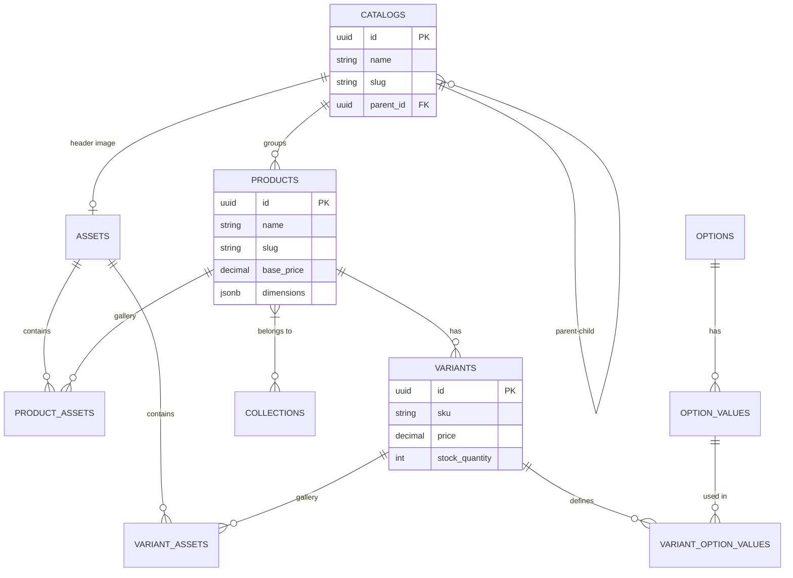

# System Design - Thien An Furniture Monorepo

This document outlines the architectural design and system components of the Thien An Furniture platform.

## 🌟 System Overview

The platform is a modern e-commerce solution for Thien An Furniture, consisting of a customer-facing storefront and a robust administrative backend. The primary goals are scalability, code reusability, and a seamless user experience across the catalog management and shopping journey.

## 🏗 Architecture

The project is structured as a **Turborepo** monorepo, separating concerns into applications and shared packages.

### 📱 Applications (`/apps`)
- **[admin](file:///Users/quocdao/freelance/furniture-monorepo/apps/admin)**: 
    - **Purpose**: Internal dashboard for managing products, categories, assets, and orders.
    - **Tech**: Next.js 15 (App Router), React Server Components, Server Actions.
- **[web](file:///Users/quocdao/freelance/furniture-monorepo/apps/web)**: 
    - **Purpose**: Public storefront for customers to browse and buy furniture.
    - **Tech**: Next.js 15 (App Router).

### 📦 Shared Packages (`/packages`)
- **[database](file:///Users/quocdao/freelance/furniture-monorepo/packages/database)**: Shared Drizzle ORM schema and PostgreSQL client.
- **[ui](file:///Users/quocdao/freelance/furniture-monorepo/packages/ui)**: Centralized component library built on Shadcn UI and Tailwind CSS.
- **[assets](file:///Users/quocdao/freelance/furniture-monorepo/packages/assets)**: Utility for managing media uploads directly to Vercel Blob.
- **config-packages**: Shared ESLint, TypeScript, and Tailwind configurations.

---

## 📊 Data Model

The database uses PostgreSQL with Drizzle ORM. Below is the simplified representation of the core entities.

### Key Schema Features
- **Self-Referencing Catalogs**: Supports deep nesting of categories (e.g., Living Room > Seating > Sofas).
- **Flexible Options**: Products can have multiple variants (e.g., Color, Material) through a normalized Option/Value system.
- **Asset Links**: Centralized asset management allows the same image to be reused across products, variants, or catalogs.

---

## 🛠 Key Workflows

### 1. Product Lifecycle
1. **Creation**: Admin creates a product, assigning it to a catalog and providing metadata (dimensions, descriptions).
2. **Asset Upload**: Images are uploaded to **Vercel Blob** via the `packages/assets` utility.
3. **Primary Image**: A specific asset is marked as "Primary" for use in product listing cards.
4. **Variant Management**: Admin defines SKUs, specific pricing, and options for each product variation.

### 2. Asset Management Strategy
- Assets are stored with path-prefixes: `products/{slug}/` for better organization and cache control.
- Metadata is stored in the `assets` table for quick lookups and alt-text optimizations.

---

## ⚡️ Tech Stack Rationale

| Technology | Purpose | Why? |
| :--- | :--- | :--- |
| **Turborepo** | Monorepo Orchestration | Fast builds, task caching, and clean package boundaries. |
| **Next.js 15** | Application Framework | RSC for performance, Server Actions for type-safe data mutations. |
| **Drizzle ORM** | Data Access | Type-safe SQL, lightweight performance, and excellent DX. |
| **PostgreSQL** | Primary Database | Reliable, relational ACID transactions for e-commerce data. |
| **Tailwind CSS** | Styling | Rapid UI development with consistent design tokens. |
| **Vercel Blob** | Media Hosting | High-performance, serverless edge storage. |

---

## 📐 Development Standards

- **Type Safety**: End-to-end TypeScript from DB schema to UI props.
- **Component Driven**: New UI patterns should be added to `packages/ui` first.
- **Server First**: Prefer Server Components and Server Actions over client-side fetching where possible.
- **Linting**: Enforced shared rules via `packages/eslint-config`.
